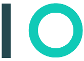
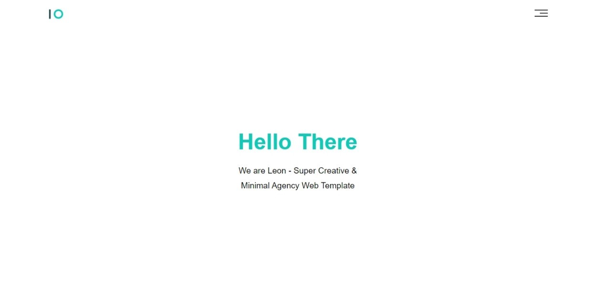
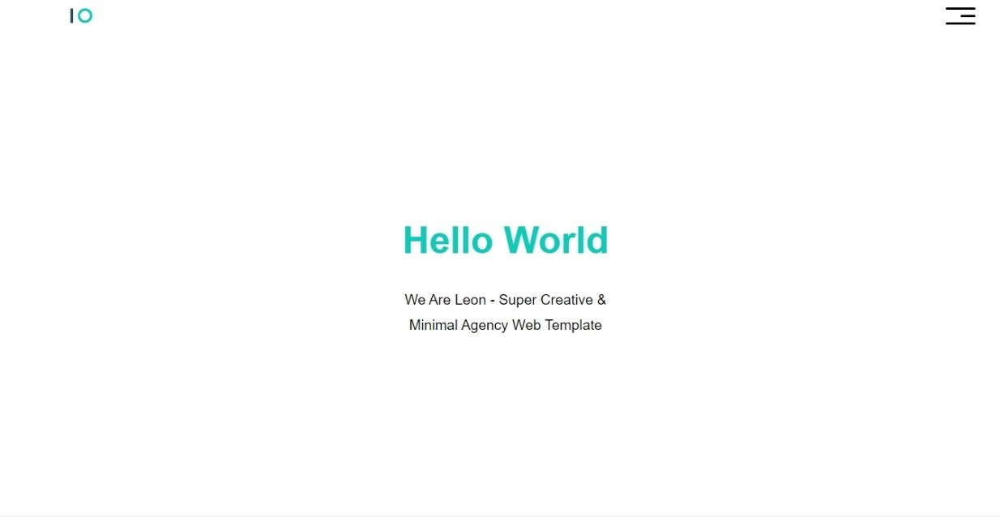

  
  <h1 align="center"><a href=""> Leon | Elzero Template One </a></h1>
  

     This is a solution fro <a href="https://elzero.org/practical-html-css/">Elzero HTML, CSS Templates practice</a>. From <a href="https://elzero.org/">Elzero web School</a>.
   

## Table of Contents

- [Overview](#overview)
  - [Quick Introduction](#quick-introduction)
  - [Challenge Requirements](#challenge-requirements)
  - [What I Implemented](#what-i-implemented-🤔)
  - [Screenshots](#screenshots-📸)
    - [Original website](#original-website)
    - [Mine](#mine-🌚)
  - [Links](#links)
- [My process](#my-process)
  - [Built with](#built-with)
  - [What I learned](#what-i-learned)
- [Author](#author)
- [Special Thanks](#special-thanks)

## Overview

### Quick Introduction
This website is a solution for one of four website (template) that [Elzero](https://elzero.org/) give as assiments to test the students skills.
**Note:** This website for educational purpose.

### Challenge Requirements 🏳
> Simply programme (build) the [website]() that have been given to you.

### What I Implemented 🤔
I programme the website to look exactly smiler.

### Screenshot 📸
#### Original website

#### Mine 🌚

They are like brother, aren't they 🤔.

### Links
Original website: [https://](https)
Mine: [https://](https)

## My process
### Built with
- HTML5 & CSS3
- Flex box
- Responsive website from the smallest screen to the biggest

### What I learned
- font-awesome Icon

## Author
- [@mohammed-Aljablai](https://github.com/mohammed-aljablai)

## Special Thanks
After Thanks Allah and the person who support me, I would like to thanks the one who educated me and million of people like me Eng.[Osama Mohammed](https://github.com/OsamaElzero).

# Stars ✨ will help me.